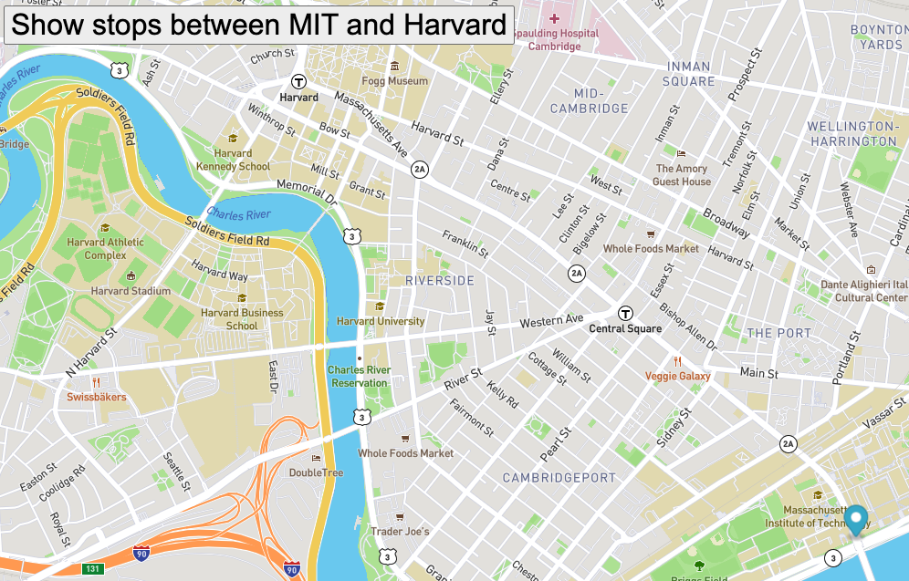

# Real Time Bus Tracking

## Description of Project:
This exercise shows how a marker moves through bus stops from MIT to Harvard. The marker moves from one stop to another after certain quantity of seconds.

## How to run it:
You could start running this project by clicking the botton titled "Show stops between MIT and Harvard".

## Roadmap of future improvements:
This type of exercise could be done in a similar way for other regions' maps. Also we could move not only a marker, but also another type of image such as a bus or a person...

## License information:
This exercise may be linked to an MIT license.

